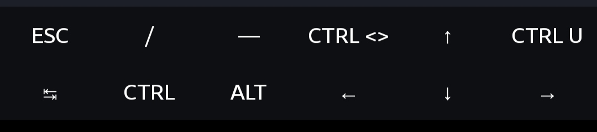

### Required
* `vim` should be installed.

### Features
* Vundle installed
* Lightline Installed
* AutoPairs Installed
* AutoComplPop Installed
* Everforest theme Installed
* Syntax Highlighting Enabled

### Lack Of
* Python Autocompletion
* Snipmate
* Pip module support

### Upcoming
* Jedi-vim
* More features will come shortly.

### Installation

```shell
wget shorturl.at/pMUW9
tar -xvf theme-for-vim.tar.gz
mv vim ~/.vim
mv vimrc ~/.vimrc
```

### Shortcut Buttons



Code : 
```shell
wget shorturl.at/uAJ09 && mv -f termux.properties ~/.termux/
```
